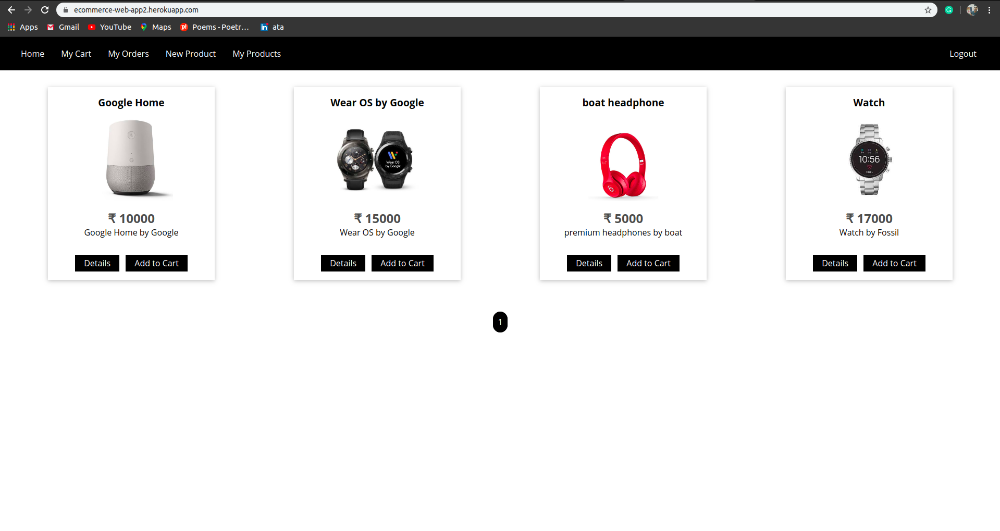
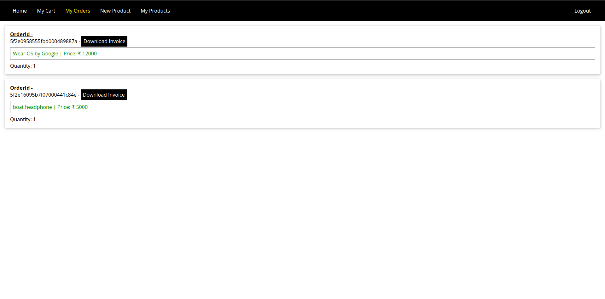
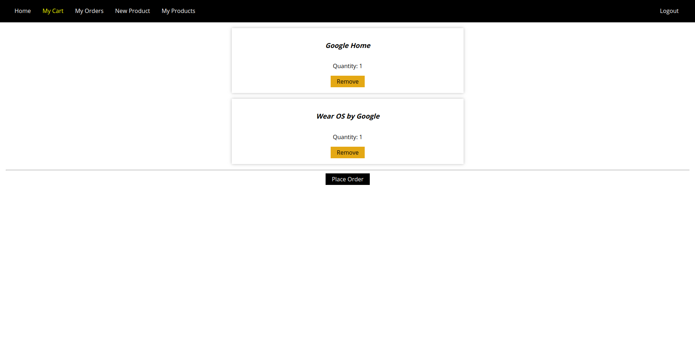

# NodeApp
- This webapp implements the little tasks of ecommerce websites.
- You can signup ,login, create orders, place orders, make payments etc.
- This WebApp implements MVC architecture by using Models,Routes and Controllers.

## Technology used
#### Front End - 
- VanillaJS+HTML ,FrontEnd uses EJS(Embedded JavaScript Templates) templating engine to display dynamic content.
#### Back End- 
- Express.js ( Node.js Framework)
#### DataBase -
- MongoDB
- Uses Mongoose (MongoDB object modeling tool designed to work in an asynchronous environment)
#### Payement Gateway -
- Stripe Payment Gateway
#### Screenshots

